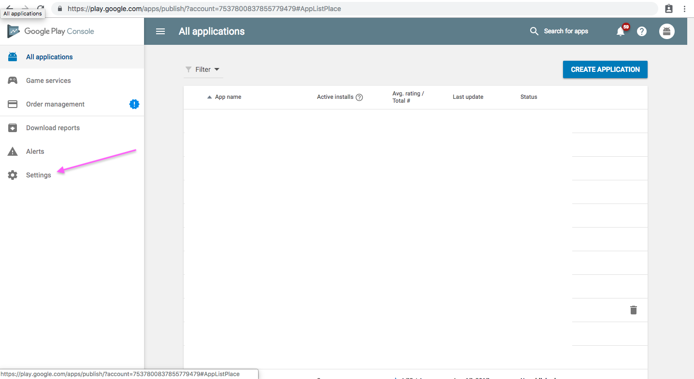
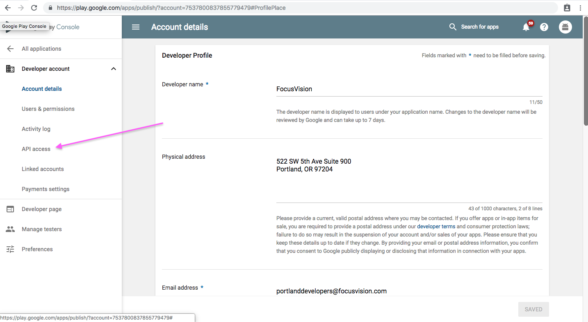
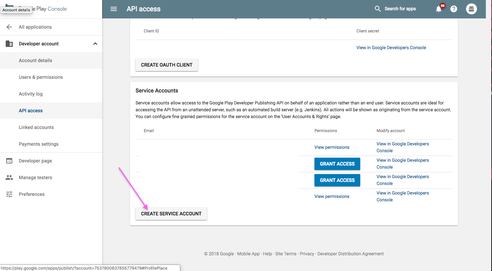
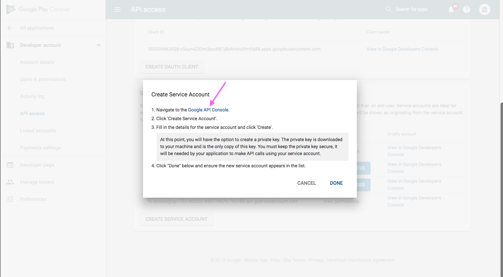
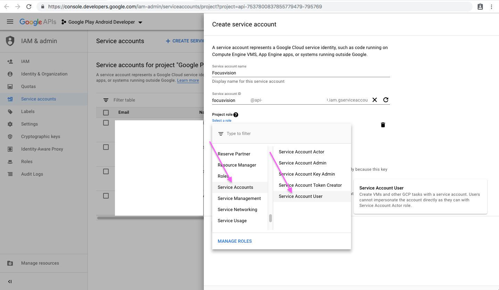
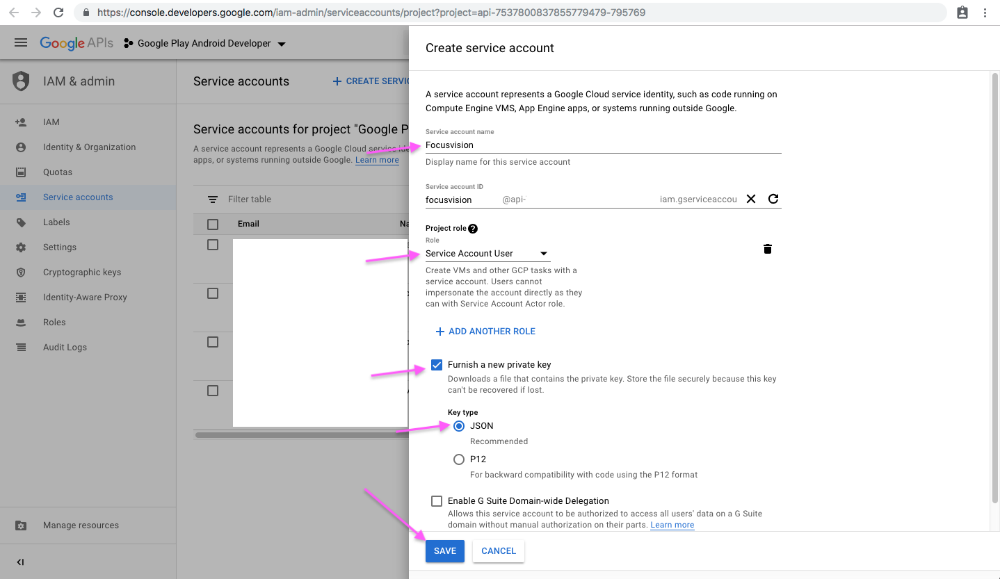
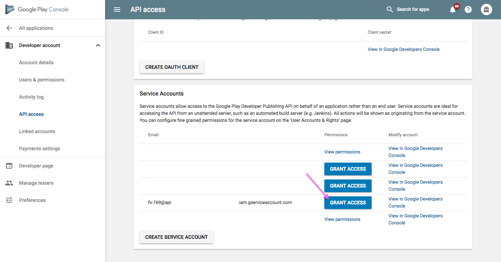
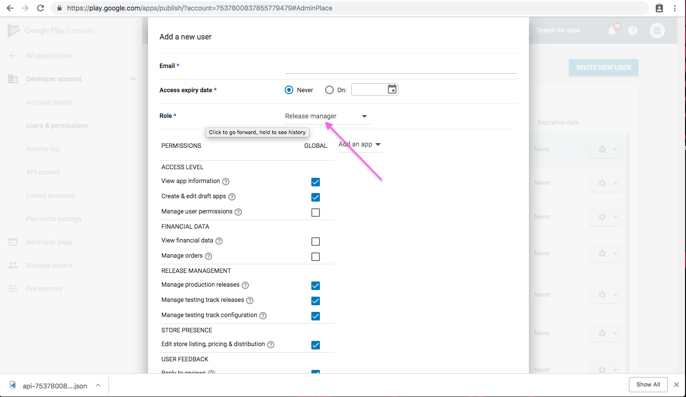
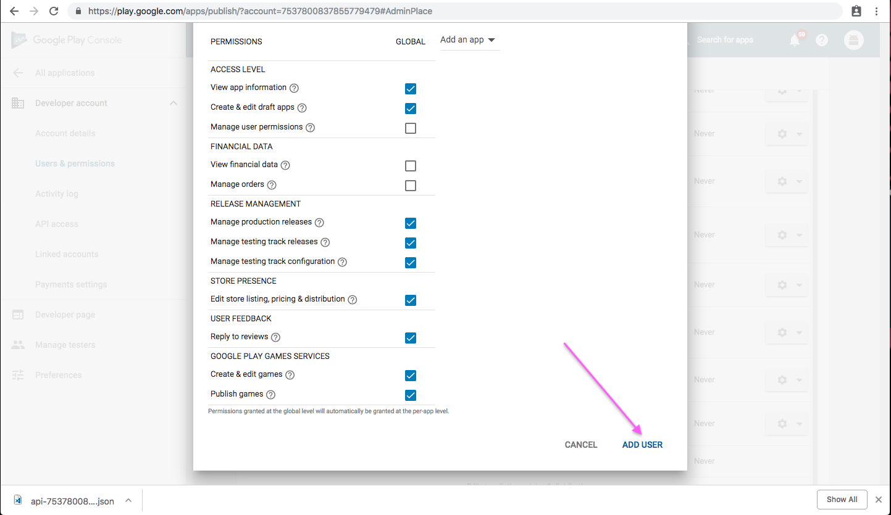

# Creating Google Credentials for Deploying Whitelabel apps

1.  Open the [Google Play Console](https://play.google.com/apps/publish/)
2.  Click the **Settings** menu entry, followed by **API access**
    
3.  Click the **CREATE SERVICE ACCOUNT** button
    
4.  Follow the **Google Developers Console** link in the dialog, which opens a new tab/window:
    
    

    1.  Click the **CREATE SERVICE ACCOUNT** button at the top of the Google Developers Console
        
    2.  Provide a Service account name
    3.  Click Select a role and choose **Service Accounts** > **Service Account User**
        
    4.  Check the Furnish a new private key checkbox
    5.  Make sure JSON is selected as the Key type
    6.  Click **SAVE** to close the dialog
        
    7.  Make a note of the file name of the JSON file downloaded to your computer

5.  Back on the Google Play Console, click **DONE** to close the dialog
6.  Click on **Grant Access** for the newly added service account
    
7.  Choose **Release Manager** from the Role dropdown
    
8.  Click **ADD USER** to close the dialog
    
9.  Send the `app-***********.json` file that was downloaded to us
